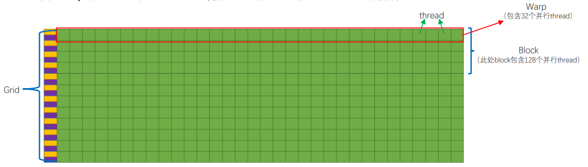
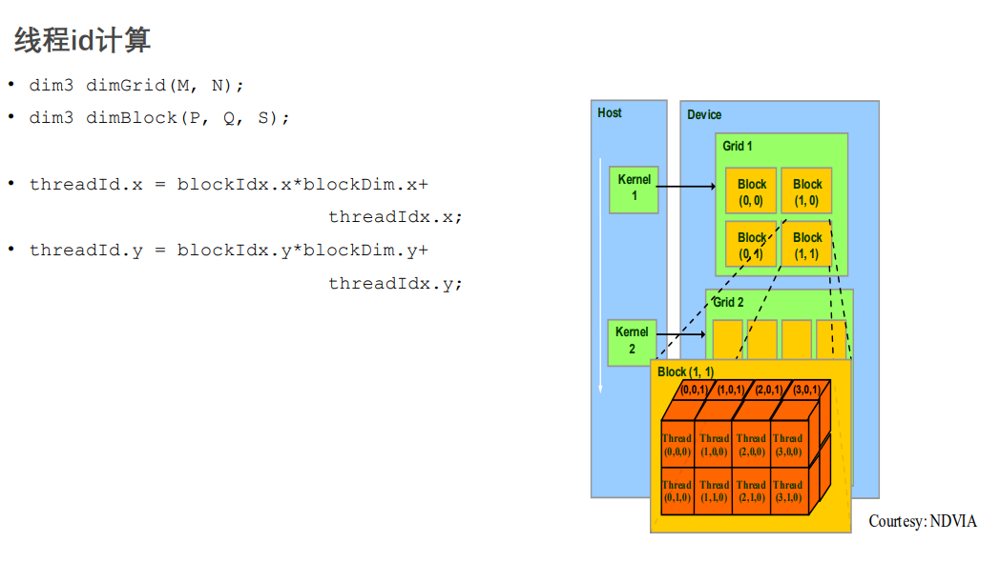

## pipeline tech

1. 什么是流水线？

* 计算机中的流水线是把一个重复的过程分解为若干个子过程，每个子过程与其他子过程并行进行。由于这种工厂中的生产流水线十分相似，因此称为流水线技术

* 从本质上来讲，流水线技术是一种时间并行技术

2. 指令重叠方式

* 顺序执行： 控制简单， 节省设备； 但是速度慢，功能部件的利用率低

* 重叠方式执行方法： 指令的执行时间短，功能部件的利用率明显提高；但是需要增加一些硬件；控制过程复杂

3. 流水线工作设计

* 基本思想： 延伸重叠方式，使指令解释过程进一步细化，提高各部件的利用率，以提高指令执行速度

* 理想目标： 完成任务时间与操作处理过程无关，只与提供操作的速度有关

假设一个任务有n个指令，将完成一个指令分为m个段，每段执行时间为△t ，则理想目标是完成任务的时间是T=m△t+(n-1)△t；当n >> m时，T=(n-1)△t。 指令执行频率为  1 / △t： 即 与m无关，只和提供操作的速度△t有关

4. 流水线特点

* 在流水线处理器中，连续任务是充分发挥流水线的效率必要条件之一
*  一个任务的执行过程可以划分成多个有联系的子任务，每个子任务由一个专门的功能部件实现
*  每个功能部件后面都有缓冲存储部件，用于缓冲本步骤的执行结果
*  同时有多个任务在执行；每个子任务的功能部件并行工作，但各个功能部件上正在执行的是不同的任务
*  各子任务执行的时间应尽可能相近
*  流水线有装入时间和排空时间，只有流水线完全充满时， 流水线的效率能得到充分发挥

## CPU 的三级缓存

1. 根据数据读取顺序和与CPU结合的紧密程度，CPU缓存可以分为一级缓存，二级缓存，部分高端CPU还具有三级缓存，每一级缓存中所储存的全部数据都是下一级缓存的一部分，这三种缓存的技术难度和制造成本是相对递减的，所以其容量也是相对递增的。当CPU要读取一个数据时，首先从一级缓存中查找，如果没有找到再从二级缓存中查找，如果还是没有就从三级缓存或内存中查找。
       
2. 一般来说，每级缓存的命中率大概都在80%左右，也就是说全部数据量的80%都可以在一级缓存中找到，只剩下20%的总数据量才需要从二级缓存、三级缓存或内存中读取，由此可见一级缓存是整个CPU缓存架构中最为重要的部分。

3. 目前缓存基本上都是采用SRAM存储器，SRAM是英文StaticRAM的缩写，它是一种具有静志存取功能的存储器，不需要刷新电路即能保存它内部存储的数据。不像DRAM内存那样需要刷新电路，每隔一段时间，固定要对DRAM刷新充电一次，否则内部的数据即会消失，因此SRAM具有较高的性能，但是SRAM也有它的缺点，即它的集成度较低，相同容量的DRAM内存可以设计为较小的体积，但是SRAM却需要很大的体积，这也是目前不能将缓存容量做得太大的重要原因。

4. 它的特点归纳如下：优点是节能、速度快、不必配合内存刷新电路、可提高整体的工作效率，缺点是集成度低、相同的容量体积较大、而且价格较高，只能少量用于关键性系统以提高效率。

## 什么样子的问题适合GPU

* 大规模的并行运算而优化

1. 计算密集：数值计算的比例要远大于内存操作，因此内存访问的延时可以被计算掩盖。
2. 数据并行： 大任务可以拆解为执行相同指令的小任务，因此对复杂流程控制的需求较低。

* 因为GPU并行计算部分的吞吐量好 因此GPU比CPU,单位时间内执行指令数量10倍以上

## GPU 线程束warp 

GPU控制单元与计算单元是如何结合的，warp线程束是如何在软件和硬件端被执行的，为什么说线程束是执行核函数的最基本单元

1. SM采用的SIMT(Single-Instruction, Multiple-Thread，单指令多线程)架构，warp(线程束)是最基本的执行单元，一个warp包含32个并行thread，这些thread以不同数据资源执行相同的指令。warp本质上是线程在GPU上运行的最小单元。

2. 当一个kernel被执行时，grid中的线程块被分配到SM上，一个线程块的thread只能在一个SM上调度，SM一般可以调度多个线程块，大量的thread可能被分到不同的SM上。每个thread拥有它自己的程序计数器和状态寄存器，并且用该线程自己的数据执行指令，这就是所谓的Single Instruction Multiple Thread(SIMT)

3. 由于warp的大小为32，所以block所含的thread的大小一般要设置为32的倍数

## 线程ID 计算下图中的线程ID

// 2D grid of 3D blocks

__device__ int getGlobalIdx_2D_3D() {

  int blockId = blockIdx.x + blockIdx.y * gridDim.x;

  int threadId = blockId * (blockDim.x * blockDim.y * blockDim.z) +

      (threadIdx.z * (blockDim.x * blockDim.y)) +

      (threadIdx.y * blockDim.x) + threadIdx.x;

  return threadId;

}

block (1,1)
thread (3,0,0)
