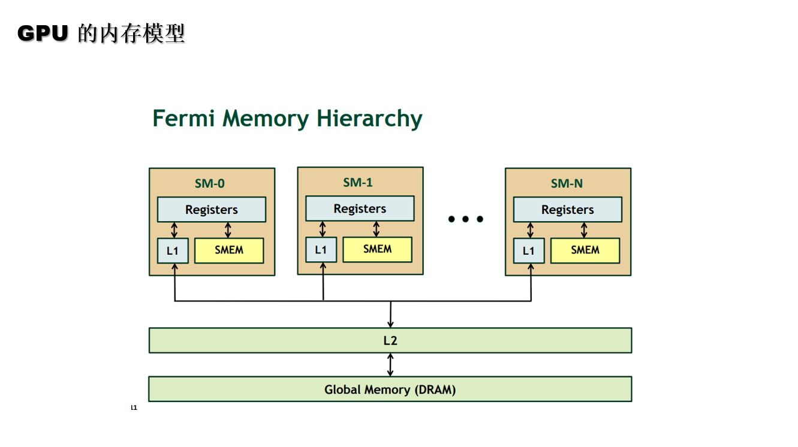
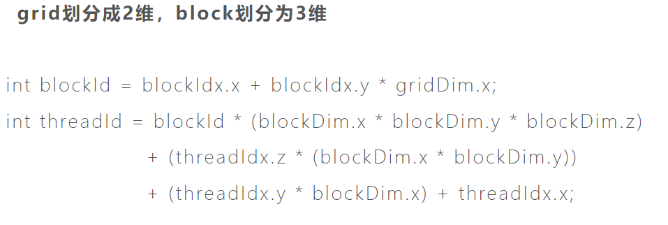

## pipeline tech

1. 什么是流水线？

* 计算机中的流水线是把一个重复的过程分解为若干个子过程，每个子过程与其他子过程并行进行。由于这种工厂中的生产流水线十分相似，因此称为流水线技术

* 从本质上来讲，流水线技术是一种时间并行技术

2. 指令重叠方式

* 顺序执行： 控制简单， 节省设备； 但是速度慢，功能部件的利用率低

* 重叠方式执行方法： 指令的执行时间短，功能部件的利用率明显提高；但是需要增加一些硬件；控制过程复杂

2. 什么是流水线前送机制

* 数据前推：将计算结果从其产生处直接送到其他指令需要处或所有需要的功能单元处，避免流水线暂停。如图5-6所示的例子，新的$1值实际在第1条ori指令的执行阶段已经计算出来了，可以直接将该值从第1条ori指令的执行阶段送入第2条ori指令的译码阶段，从而使得第2条ori指令在译码阶段得到$1的新值。也可以直接将该值从第1条ori指令的访存阶段送入第3条ori指令的译码阶段，从而使得第3条ori指令在译码阶段也得到$1的新值



3. 如何使得CPU的效率显著增加的

通过增加功能单位可以解决资源冲突，通过把流水线后面的计算结果立刻向前传可以避免许多数据冲突


## CPU 的三级缓存

* CPU的三级缓存
CPU中有L1 Cache(一级缓存)、L2 Cache(二级缓存)、L3 Cache(三级缓存)共3级缓存，这3级缓存的特点是什么，哪些内容适合放在哪一级别的缓存上。

1. 首先，我们在这些L1，L1和L2缓存中具有L3缓存。 它是最快的，因为它是最接近原子核的那个。 因此，它能够实现 在某些时候速度高达1150GB / s。 它的大小很小，只有256 KB，尽管部分取决于CPU的能力。 由于在其他型号中，尺寸可能会更大，最大可达四倍。

2. L1缓存分为两种：一种用于数据，另一种用于指令。 第一个存储已处理的数据，第二个存储有关必须完成的操作的信息。 另外，请记住，每个内核都有其自己的L1缓存。 因此，在6核处理器中，我们发现总共有六个L1高速缓存。

3. 其次，我们找到L2缓存。 尽管它比前一个慢，但它具有更大的存储容量。 因为在这种情况下，我们发现 在其运行峰值时达到470 GB / s。 另外，在这种情况下的大小显着地是可变的。 它可以像上一个一样小，只有256 KB甚至轻松超过15 MB。

4. 在这个缓存中是 它们存储了CPU不久将要使用的指令和数据。 它不像以前的情况一分为二。 尽管在这种情况下，每个内核都会重复使用L2高速缓存，但是至少在功能最强大的处理器中是这样。

5. 第三，我们找到L3缓存。 在这种情况下，处理器芯片上有专用的空间。 这是最大的内存 在这些高速缓存L1，L2和L3中，它们也是最慢的。 在他的情况下，最大速度下达到200 GB / s。 大小可能从4到64MB不等。

再次，它分布在处理器内核之间。正常情况是每个内核有几个MB，但是这种划分取决于每个处理器。

## 什么样子的问题适合GPU

适合GPU运算的运算类型有以下六种：

（1）大量的轻量级运算

即用大量数据或者用同一数据多次调用同一公式或者计算过程，公式本身并不复杂，只是执行的次数较多，这是GPU先天的优势。

（2）高度并行

高度并行指的就是各个数据之间运算互不影响，即耦合度较低。由于GPU本身硬件基础决定，各个workgroup之间并不相互通信，只有同一workgroup内的work-item之间才相互通信，所以GPU本身并不支持迭代等数据耦合度较高的计算，这是GPU本身要求。

（3）计算密集型

任务可以分为计算密集型和IO密集型。计算密集型，即少量的IO读取+大量的计算，消耗CPU资源较多；而IO密集型，是指多次使用IO读取+少量计算，这种情况涉及到寄存器与内存之间以及与设备内存之间的通信问题，主要限制原因是显存带宽问题。

（4）控制简单

对比GPU来说，CPU更擅长判断、逻辑控制、分支等，有通用计算能力，并含有强大的ALU（算术运算单元）；而GPU更适合于逻辑简单的运算。

（5）多个阶段执行。

运算程序可分解为多个小程序或者同一程序可分多个阶段执行，这就类似于使用集群处理同一任务，将其分解为多个任务碎片分发到各节点执行，以提高运算速率。

（6）浮点型运算。

GPU擅长浮点型运算。


## GPU 线程束warp 


GPU控制单元与计算单元是如何结合的，warp线程束是如何在软件和硬件端被执行的，为什么说线程束是执行核函数的最基本单元

1. SM采用的SIMT(Single-Instruction, Multiple-Thread，单指令多线程)架构，warp(线程束)是最基本的执行单元，一个warp包含32个并行thread，这些thread以不同数据资源执行相同的指令。warp本质上是线程在GPU上运行的最小单元。

2. 当一个kernel被执行时，grid中的线程块被分配到SM上，一个线程块的thread只能在一个SM上调度，SM一般可以调度多个线程块，大量的thread可能被分到不同的SM上。每个thread拥有它自己的程序计数器和状态寄存器，并且用该线程自己的数据执行指令，这就是所谓的Single Instruction Multiple Thread(SIMT)

3. 由于warp的大小为32，所以block所含的thread的大小一般要设置为32的倍数


## 线程ID 计算下图中的线程ID


 2D grid of 3D blocks

```
__device__ int getGlobalIdx_2D_3D() {

  int blockId = blockIdx.x + blockIdx.y * gridDim.x;

  int threadId = blockId * (blockDim.x * blockDim.y * blockDim.z) +

      (threadIdx.z * (blockDim.x * blockDim.y)) +

      (threadIdx.y * blockDim.x) + threadIdx.x;

  return threadId;
}
```





blockid = 3

threadid = 3*(4 * 2 * 2) + 3 = 51
