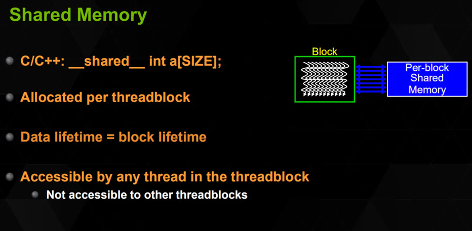

## CPU, GPU ori (P40), GPU titled (P40) on blocksize 64 and 512

1. 什么是流水线？

* 计算机中的流水线是把一个重复的过程分解为若干个子过程，每个子过程与其他子过程并行进行。由于这种工厂中的生产流水线十分相似，因此称为流水线技术

## Block-size 在共享内存使用和不过分共享内存使用有什么区别

1. 什么是共享内存

共享内存是优化CUDA程序的核心方法。共享内存可以通过对全局内存数据进行合并访问，让kernel内交错的内存需求去访问共享内存。如：矩阵转置问题，将二维内存的行写入二维内存的列。对列的写入就是一个内存交错访问的例子。可以用合并的方式将块要操作的数据写入共享内存，让复杂的内存交错访问访问共享内存，然后将结果以合并的方式写入全局内存。共享内存是稀缺的SM上的资源，所以它会影响块在SM上的分布，影响占用率，计算一下每个块共享的低下限。对于存储体32位情况：我的GTX1050Ti 每个SM的共享内存大小是48KB，如果保证占用率的话，每个SM最多可容纳16个块，也就是每个块可以最多分配48KB/16 = 3KB的空间，换算到768个单精度的浮点数据。也就是说一个块最多可以申请768个4字节的数据，如果超过这个空间的大小，那么不能保证所有SM中有16个块，不能保证占用率。（提一下寄存器资源2048个线程运行时，每个线程32字节）

2. 共享内存运用模式

3. 共享内存：什么是区块（bank）

* GPU 的共享内存，实际上是 32 块内存条通过并联组成的（有点类似 CPU 的双通道内存条）。
* 每个 bank 都可以独立地访问，他们每个时钟周期都可以读取一个 int。
* 然后，他们把地址空间分为 32 分，第 i 根内存条，负责 addr % 32 == i 的那几个 int 的存储。这样交错存储，可以保证随机访问时，访存能够尽量分摊到 32 个区块，这样速度就提升了 32 倍。比如：__shared__ int arr[1024];
那么 arr[0] 是存储在 bank 0，arr[1] 是 bank 1……arr[32] 又是 bank 0，arr[33] 又是 bank 1。

4. 为什么不过分使用共享内存

如果多个线程同时访问到了同一个 bank 的话，就需要排队。比如下图，线程0-3同时访问了bank 0，但是同一个bank是需要排队，也就是串行访问的，所以线程0-3实际上没有真正并行起来，慢了4倍！

看似好像没什么问题，反正一般不会让两个线程访问 __shared__ 数组的同一个元素！但是bank 是按照 addr % 32 来划分的，也就是说 arr[0] 和 arr[32] 是同属于 bank 0 的，如果两个线程同时访问了 arr[0] 和 arr[32] 就会出现 bank conflict 导致必须排队影响性能！

综上所述，共享内存对程序有很好的优化，但其运用也稍有些复杂，如果能较好的处理好冲突，掌握好共享内存,让全局内存被合并访问，一定能达到最高的内存效率