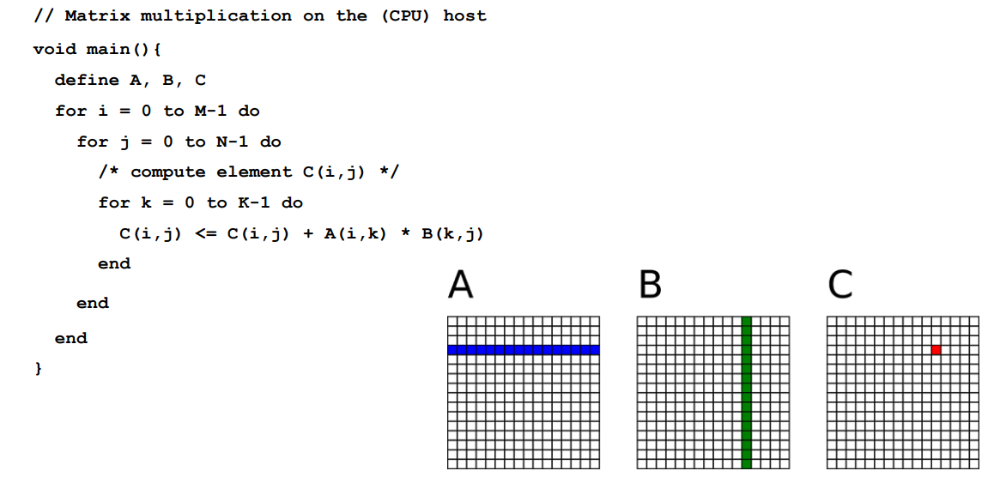
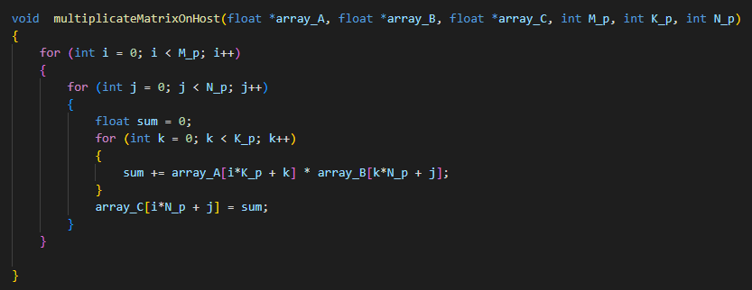
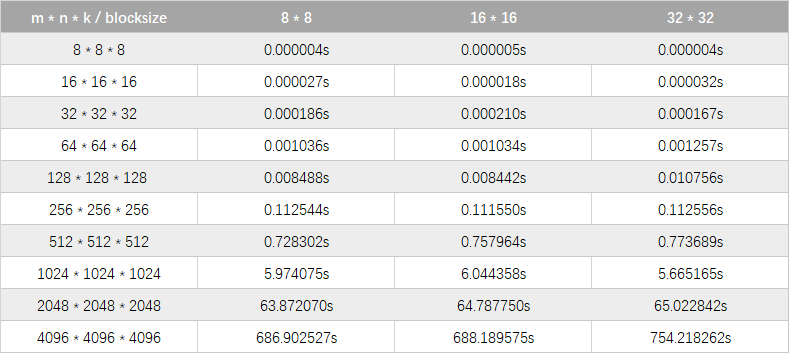
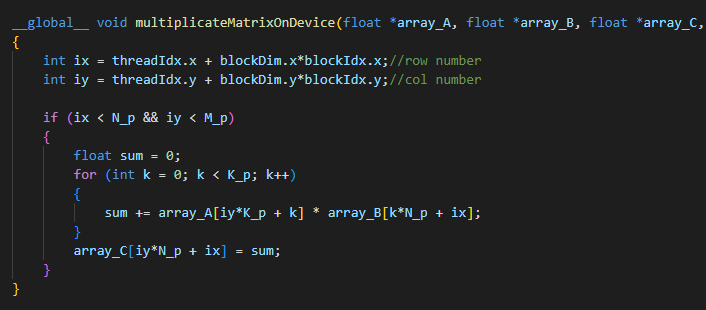
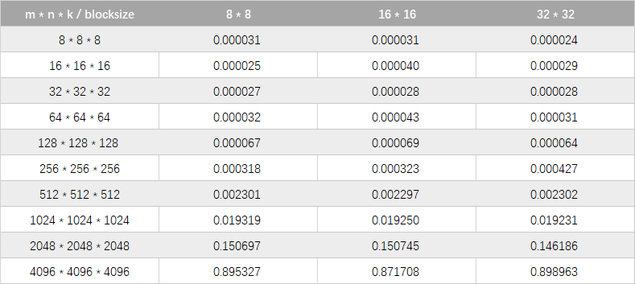
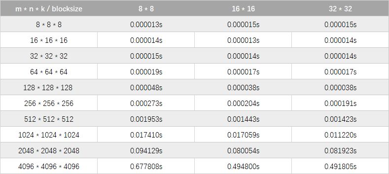
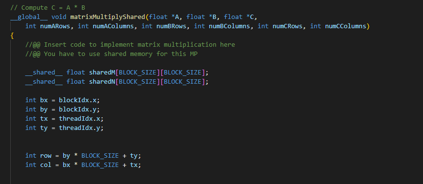
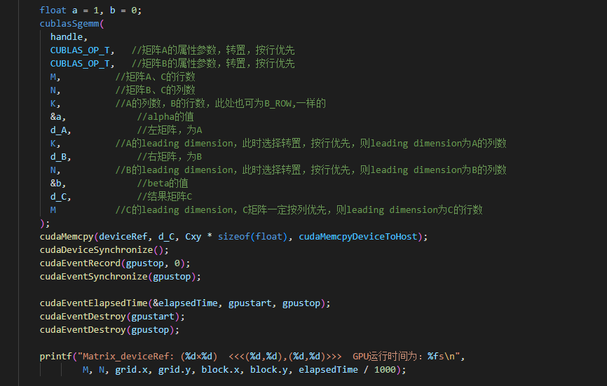

# 矩阵乘法的 CUDA 实现、优化及性能分析

## 矩阵乘法的CPU实现



CPU程序通过三层循环实现：



计算次数为 m × n × k 时间复杂度为 O(N^3) 获得C矩阵的计算方法都是相同的, 只不过使用的是矩阵 A、B不同的元素来进行计算, 即不同数据的大量相同计算操作, 这种计算是特别适合使用GPU来计算, 因为GPU拥有大量简单重复的计算单元, 通过并行就能极大的提高计算效率.

下图是cpu计算矩阵乘法，在不同blocksize运行得到的秒数



## 矩阵乘法的 GPU 常规实现使用 Global Memory
在 GPU 中执行矩阵乘法运算操作：

在 Global Memory 中分别为矩阵 A、B、C 分配存储空间.

由于矩阵 C 中每个元素的计算均相互独立, NVIDIA GPU 采用的 SIMT (单指令多线程)的体系结构来实现并行计算的, 因此在并行度映射中, 我们让每个 thread 对应矩阵 C 中1个元素的计算.

执行配置 (execution configuration)中 gridSize 和 blockSize 均有 x(列向)、y(行向)两个维度. 其中,

``` 
                    gridsize.x * blocksize.x = n
                    gridsize.y * blcoksize.y = m
```

每个 thread 需要执行的 workflow 为：从矩阵 A 中读取一行向量 (长度为k), 从矩阵 B 中读取一列向量 (长度为k), 对这两个向量做点积运算 (单层 k 次循环的乘累加), 最后将结果写回矩阵 C.

CUDA的kernel函数实现如下：



下面来分析一下该 kernel 函数中 A、B、C 三个矩阵对 global memory 的读取和写入情况：

读取 Global Memory：

对于矩阵 C 中每一个元素计算, 需要读取矩阵 A 中的一行元素;

对于矩阵 C 中同一行的 n 个元素, 需要重复读取矩阵 A 中同一行元素 n 次;

对于矩阵 C 中每一个元素计算, 需要读取矩阵 B 中的一列元素;

对于矩阵 C 中同一列的 m 个元素, 需要重复读取矩阵 B 中同一列元素 m 次;

写入 Global Memory：

矩阵 C 中的所有元素只需写入一次.
由此可见：

对 A 矩阵重复读取n次, 共计 m × k × n次 32bit Global Memory Load操作;
对 B 矩阵重复读取m次, 共计 k × n × m次 32bit Global Memory Load操作;
对 C 矩阵共计m × n次, 32bit Global Memory Store操作.

下图是gpu 在global memory计算矩阵乘法，在不同blocksize运行得到的秒数



结果分析：
* 随着矩阵规模增大，计算性能不断提升，到达峰值后又略有下降。在矩阵规模较小时，由于block数量不够多，无法填满所有SM单元，此时的性能瓶颈为Latency Bound（由于低Occupancy导致GPU计算资源的利用率低，延迟无法被很好的隐藏）；随着矩阵规模增加，block数量增加，每个SM中的active warps数量随之增大，此时Latency不再是性能瓶颈，转而受限于Memory Bound（过多的高延迟、低带宽的全局内存访问），在无法提升memory访问效率的情况下，性能无法进一步提升；

* 不同的blockSize对性能的影响不大（这里仅限于讨论88,1616,32*32三种情况）。究其原因，是因为我们选择的几种block维度设计（每行分别有8/16/32个thread），对1个warp内访问Global Memory时（Load或Store）transaction的数量没有变化


## 矩阵乘法的 GPU 常规实现使用 Shared Memory

虽然 warp 内对 Global Memory 的访问均已最大的实现了合并访问，但在 A、B 矩阵的读取操作中仍然有很多重复访问，例如，对于矩阵 A 的读取操作，通过合并访问（32 个 thread 访问 Global Memory 的同一地址，合并为一次访问），实际重复读取次数是(n/32); 对于矩阵 B 的读取操作，通过合并访问（8 个 thread 访问 32 Byte 数据可合并为一次），实际重复读取次数为(m/8)次。

在不改变这种数据读取方式的前提下又如何优化性能呢？在GPU中除了 Global Memory 还有 Shared Memory，这部分 Memory 是在芯片内部的，相较于 Global Memory 400~600 个时钟周期的访问延迟，Shared Memory 延时小 20-30 倍、带宽高 10 倍，具有低延时、高带宽的特性。因此性能优化的问题可以转变为如何利用 Shared Memory 代替 Global Memory 来实现数据的重复访问。

使用 Shared Memory 优化 Global Memory 访问的基本思想是充分利用数据的局部性。让一个 block 内的 thread 先从 Global Memory 中读取子矩阵块数据（大小为 BLOCK_SIZE*BLOCK_SIZE）并写入 Shared Memory 中; 在计算时，从 Shared Memory 中（重复）读取数据做乘累加，从而避免每次都到 Global 中取数据带来的高延迟影响。接下来让子矩阵块分别在矩阵 A 的行向以及矩阵 B 的列向上滑动，直到计算完所有k个元素的乘累加。







## 矩阵乘法的 GPU 常规实现使用Titled shared memeory， 调用Cublas

前面的算法设计中，每个线程只计算了矩阵 C 中的一个元素，每个线程每个内层循环需要从子矩阵 A 和子矩阵 B 中各读取一个 4Byte 的元素（共取 8Byte 数据执行2次浮点运算），实际上我们可以让每个线程读取一组 Shared Memory 数据后（放入寄存器中），计算更多的元素，从而减少 Shared Memory 的访问。



上面的 kernel 函数中，注意观察内层循环：我们让 1 个 thread 分别从子矩阵 A 中读取 2 个数据，从子矩阵 B 中读取 1 个数据（注意2次取数据是同一地址！），然后同时计算2个元素 val[0] 和 val[1]。此时，通过读取 4B*3 个数据，实现了2次乘加共4次浮点计算。减少了 shared memory 中子矩阵B一半的数据访问。


Shared Memory Load：在每 1 次内层循环中，1 个 warp 内的 32 个 thread 需要从 shTileA 读取同 2 个元素，需要 2 次 Shared Memory Load Transactions，再从 shTileB 中读取连续的 32 个元素（假设没有 Bank Conflict，需要1次 Shared Memory Load Transactions）（注意val[0]和val[1]的计算中，shTileB 的地址是一样的），即总共需要 3 次 Shared Memory Load Transactions。


对GPU三个版本，从图中可以看出：

1. 在句子规模为 4K * 4K * 4K 的情况下， cublas 性能更高

2. 随着矩阵规模的增加， 计算性能也逐渐增加

3. 通过利用shared memory和寄存器能有效的降低IO带宽对性能的影响，从而高效的利用对GPU的硬件计算资源。

